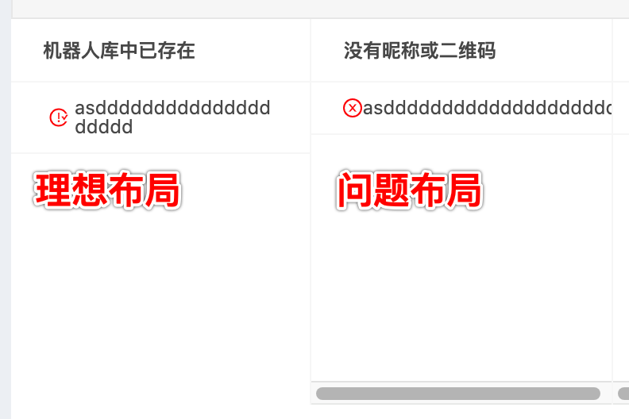

# flex布局的问题

话不多说，先上图（左边是理想布局，右边是问题布局）



事情是这样的，父节点设置了 display: flex; 然后左边的子节点 宽度固定，右边撑起剩余的宽度，如果只是简单的给右边子节点设置：flex: 1; 就会出现上图的问题布局

**正确代码如下：**

```css
/* 父节点 */
.list-item {
    display: flex;
    align-items: center;
}
/* 左边的小图标 */
.list-item span:first-child {
    width: 20px;
}
/* 右边的id容器 */
.id-box {
    flex: 1;
    width: 0;
    overflow-wrap: break-word;
}
```
