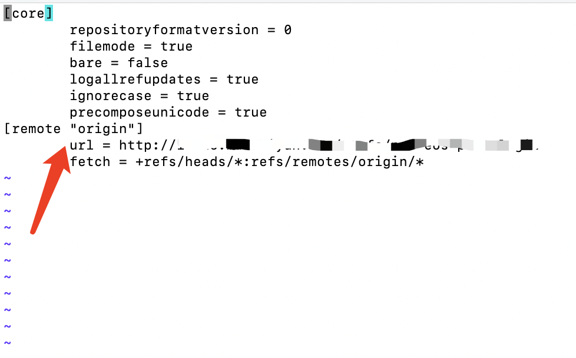
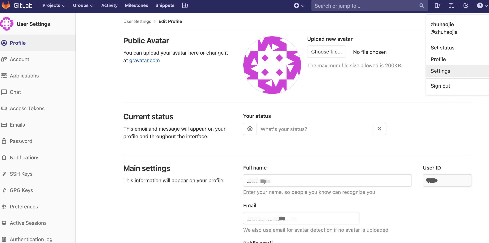

# git 常用操作

## **想把代码同时推到 github 和 gitee 远程库**

&nbsp;

1. **首先要在项目中添加两个远程库的远程源**

    ```javascript
    // 初始化 git 仓库
    git init
    // 添加远程库源，注意 两个远程库的名字不能一样 origin / origin2
    git remote add origin git@github.com......git
    git remote add origin2  git@gitee.com......git
    ```

2. **在 package.json 的 scripts 中添加一个 push 命令**

    ```javascript
    "push": "bash push.sh",
    ```

3. **在项目根目录新建一个 bash.sh 文件，写入以下内容**

    ```javascript
    #!/usr/bin/env sh

    git add -A
    git commit -m $1
    git push git@github.com:......git master
    git push git@gitee.com:......git master
    ```

4. **执行下面的命令即可同时上传到两个远程库**

    ```javascript
    // 后面跟一个参数 作为 commit -m 的值

    npm run push 'first commit'
    ```

## **连接gitlab远程库超时**

1. 在项目文件夹下执行 git config --local -e 打开git配置文件
    
2. 把url改成仓库的http地址
3. 然后进行pull或者push时可能会让输入用户名和密码，姓名时gitlab仓库中的名字，密码是gitlab的密码
    